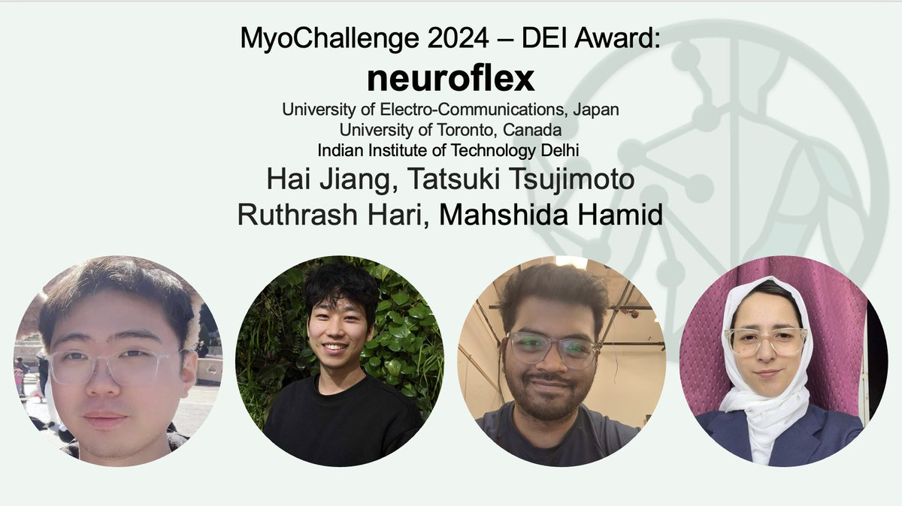

# MyoChallenge 2024 - Team Neuroflex

We won 3rd place in Bimanual Task and the DEI Award!

During the MyoChallenge workshop at NeurIPS 2024, we presented a poster; **"MyoChallenge Manipulation Track:
Deep RL for musculoskeletal and prosthesis co-manipulation"**, which explains details of our strategy
